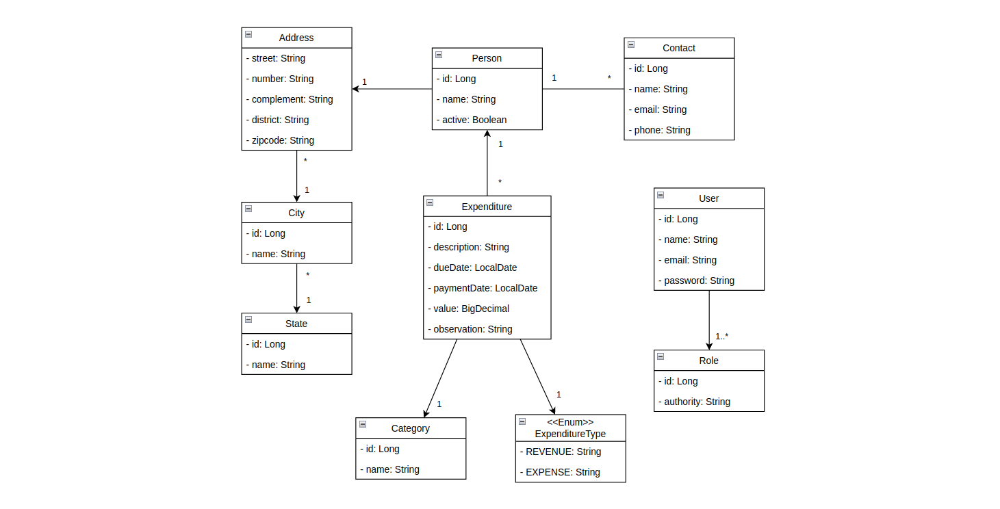

<h1 align="center"><b>FinanciaTrackr</b></h1>

<div align="center">


</div>

## 📚 Sobre

FinanciaTrackr é um projeto para controle de receitas e despesas financeiras que permite de maneira intuitiva e organizada, gerenciar suas finanças pessoais.

<!-- Acesse a aplicação em produção através [deste link](https://npi-test-challenge.vercel.app/socios) -->

Na API, a transação de dados ocorre em três camadas:

1) **Camada Rest:**  Responsável por expor os endpoints RESTful da aplicação, que permitem a interação com clientes por meio do protocolo HTTP, , no projeto em questão, o **Spring Web MVC**.

2) **Camada de Serviço:** Onde ocorre a implementação da regra de negócios;

3) **Camada de Acesso a Dados:** Mediada por entidades e pela **ORM**, no projeto em questão, o **Spring Data JPA**.

## 📘 Modelo de Domínio



## 📝 Tecnologias, Linguagens e Ferramentas Utilizadas

|     Backend     |  Frontend  | Banco de dados |     Outros     |
|:---------------:|:----------:|:--------------:|:--------------:|
|       Java      |   Angular  |  Postgres SQL  |     Docker     |
|   Spring Boot   | Primefaces |   H2 Database  | Jasper Reports |
|      Maven      | Typescript |                |     Postman    |
|  JPA/Hibernate  |   NodeJS   |                |    Beekeeper   |
| Spring Security |     npm    |                |                |
|       JWT       |            |                |                |
|      Flyway     |            |                |                |

Dependências auxiliares podem ser encontradas em: [dependencies](https://github.com/lucasferreiraz/FinanciaTrackr/network/dependencies).

## 🚀 Como executar este projeto:

- ### 🐳 Usando Docker:

```bash
# Clone o repositório
$ git clone https://github.com/lucasferreiraz/FinanciaTrackr.git

# Entre na pasta
$ cd FinanciaTrackr

# Run docker
$ docker compose up

```
Acesse o endereço http://localhost:4200


- ### ☕ Localmente (caso não tenha o Docker instalado):

> **Obs:** Necessário Java 17 no mínimo e algum serviço do PostgresSQL rodando na máquina local com um banco chamado "financiatrackr" previamente criado.


```bash
# Clone o repositório
$ git clone https://github.com/lucasferreiraz/FinanciaTrackr.git

# Entre na pasta
$ cd FinanciaTrackr/backend

# Se for Windows
$ mvnw spring-boot:run -Dspring-boot.run.profiles=dev

# Se for Linux
$ ./mvnw spring-boot:run -Dspring-boot.run.profiles=dev
```

- ### 🖌️ Frontend (se optou por rodar localmente no passo anterior)
> **Obs:** Ao rodar a aplicação Angular, verifique se as versões do Node, npm e Angular CLI instaladas em sua máquina obedecem as seguintes versões de desenvolvimento do projeto:

```
Angular CLI: 16.1.5
Node: 16.20.2
Package Manager: npm 8.19.4
```
> Caso queira usar a versão do Angular do projeto apenas localmente sem interferir com a versão global da sua máquina, instale as dependência usando  o parâmetro ```--save```

```bash
# Entre na pasta
$ cd FinanciaTrackr/frontend

# Instale as dependências
$ npm install 

# Run angular
$ ng serve
```
Acesse o endereço http://localhost:4200

- ### 🔐 Credenciais Padrão da Aplicação

    * Perfil Administrativo:
        * Email: admin@email.com
        * Senha: admin

    * Perfil de Usuário (apenas permissões de leitura):
        * Email: lucas@email.com
        * Senha: lucas


## 🖥️ Demonstração

<details>

<summary>
    <b>Login</b> 
</summary>

#### **Login da aplicação com perfil administrativo.**


</details>

<details>

<summary>
    <b>Dashboard e Menu Sidebar</b> 
</summary>

#### **Dashboard.**


#### **Sidebar Menu.**


</details>

<details>

<summary>
    <b>Módulo de Lançamentos</b> 
</summary>

#### **Painel de lançamentos.**


#### **Pesquisa de lançamentos por descrição.**


#### **Novo lançamento.**


#### **Edição de lançamento.**


#### **Exclusão de lançamento.**


</details>

<details>

<summary>
    <b>Relatório de Lançamentos</b> 
</summary>

#### **Geração do relatório em PDF usando Jasper Reports.**


</details>

<details>

<summary>
    <b>Módulo de Pessoas e Contatos</b> 
</summary>

#### **Painel de pessoas.**


#### **Ativação/Inativação de pessoa.**


#### **Pesquisa de pessoas por nome.**


#### **Nova pessoa.**


#### **Edição de pessoa.**


#### **Exclusão de pessoa.**


</details>


<p align="center" style="font-weight:bolder">
    Developed with 💛 by <a href="https://github.com/lucasferreiraz">Lucas Ferreira</a>
</p>